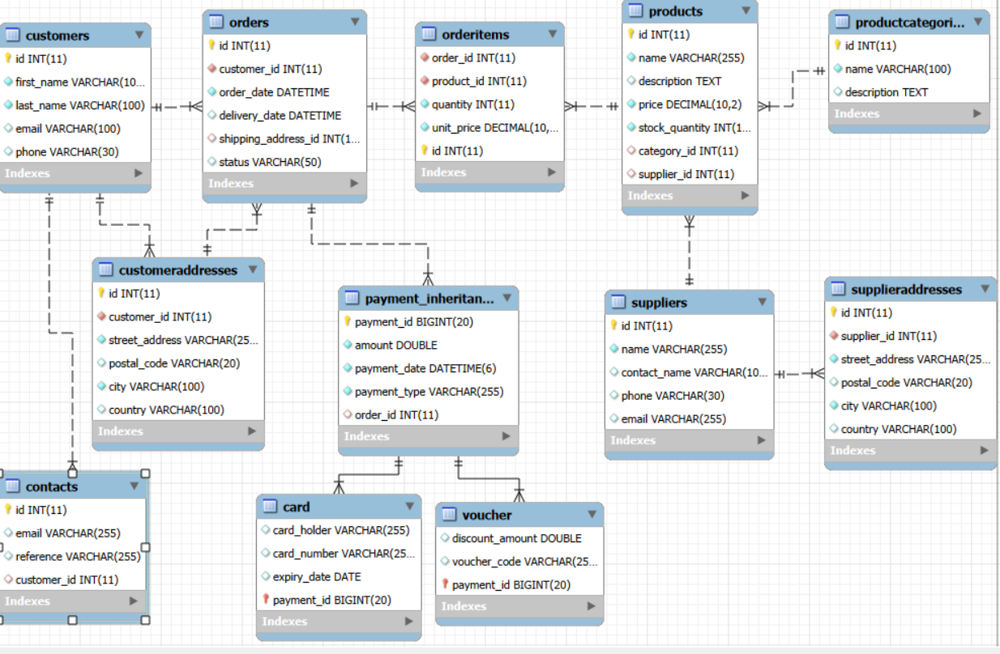
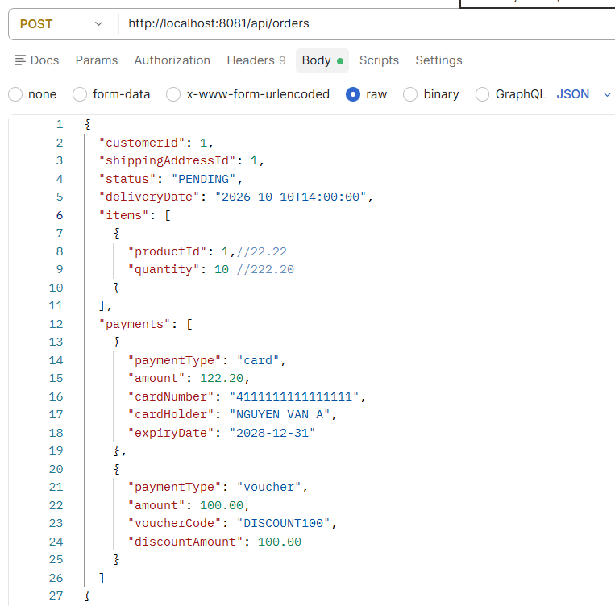
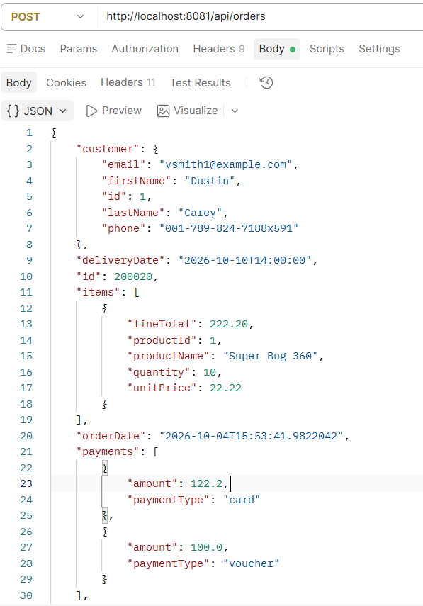
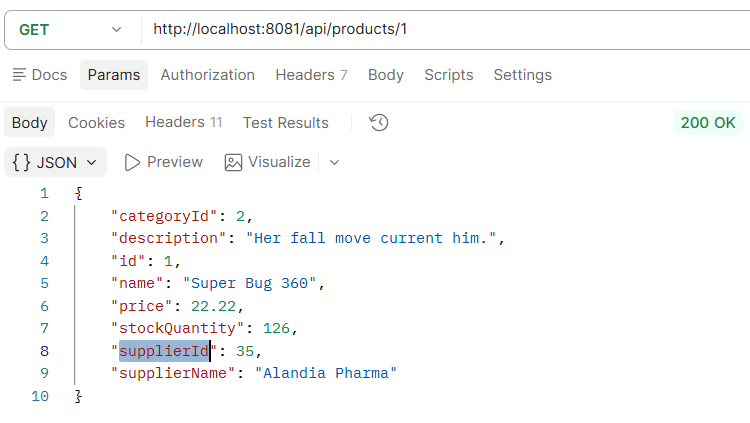
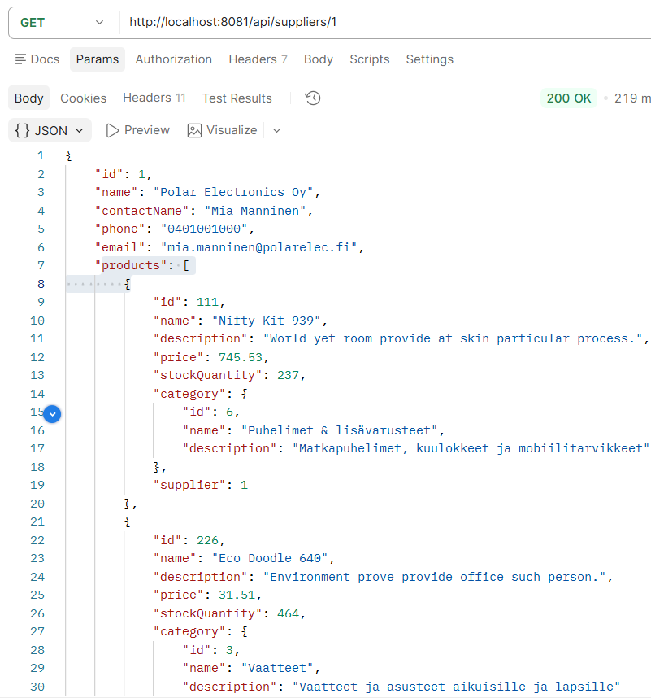
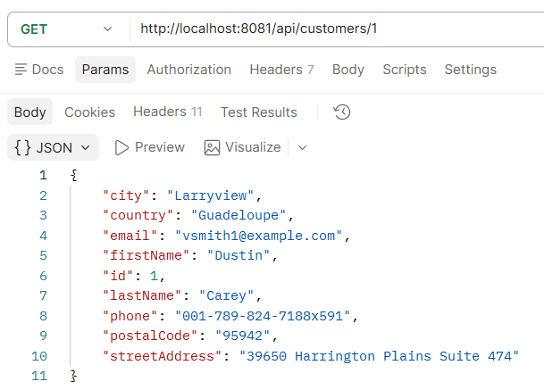
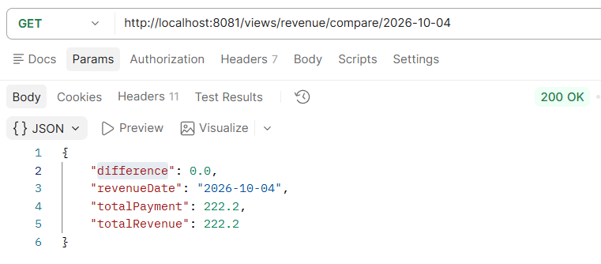

# Database Solution Project Report
This project was implemented with the assistance of Microsoft Copilot. Copilot provided code suggestions for SQL views, triggers, and events, providing code suggestions for REST API endpoints; reviewed documentation structure; and assisted with grammar checks.
## 1. Project Overview
This project implements a REST API webshop backend using Spring Boot 4.1.1, Java 21, Maven, MariaDB 11.5, and Postman.

The system provides:
- Full CRUD operations for all core webshop resources.
- Payment processing using table inheritance (Card and Voucher payments).
- Rich database functionality, including views, triggers, indexes, events, temporal features, and transactions.
- A comprehensive API suitable for both webshop customers and administrators.

## 2. Implement
## 2.1 Database Structure
**Main database tables**

|Table|Description|
|-----------------|------------|
|products|Stores product information such as name, description, price, stock quantity, and category.|
|productcategories|Stores product categories (e.g., Electronics, Clothing, Food). One category can contain multiple products.|
|suppliers|Stores information about product suppliers.|
|supplieraddresses|Stores supplier address details, such as street, city, postal code, and country.|
|customers|Stores customer information, including name, email, and phone number.|
|customeraddresses|Stores customer addresses. A customer may have multiple addresses, such as billing and shipping addresses.|
|orders|Stores order information, including customer, order date, status, and total amount.|
|orderitems|Stores the line items of an order. Each record represents a product included in a specific order.|
|contacts|Stores contact details such as contact person, email address, and phone number. Can be associated with customers or suppliers.|
|paymentinheritance|Base entity representing payment methods.|
|card|Card payment entity derived from PaymentInheritance.|
|voucher|Voucher payment entity derived from PaymentInheritance.|

**Table Relationships**

|Parent  |TableChild|TableRelationship|
|-----------------|------------|--------|
|customer|sorders|One-to-Many|
|customers|customeraddresses|One-to-Many|
|contacts|customers|Many-to-One|
|orders|orderitems|One-to-Many|
|orders|paymentinheritance|One-to-Many|
|products|orderitems|One-to-Many|
|suppliers|supplieraddresses|One-to-Many|
|suppliers|products|One-to-Many|
|productcategories|products|One-to-Many|
|PaymentInheritance|Card|InheritancePayment|
|PaymentInheritance|Voucher|InheritancePayment|

**ER Diagram**

### 2.2. Database Features
#### 2.2.1 Views
|Feature|	Desription|	Role|Purpose|
|-----|------------|--------|-----|
|customer_order_view|Stores customer information and related order data|	User/Admin|Allows customers and administrators to view order history|
|order_detail_view|	Stores detailed product information for each order|	User/Admin|	Displays product-level details within orders|
|product_sales_view|Aggregates product sales quantities and revenue|Admin|	Identifies best-selling products|
|monthly_revenue_view|	Aggregates monthly revenue data|	Admin|Supports financial reporting and revenue analysis|
|customer_total_spending_view|Calculates total spending per customer| 	Admin|Helps identify high-value customers|
|low_stock_view|Displays products with low inventory levels|		Admin|Prevents stock shortages through early detection|
|payment_summary_view|Consolidates payment information across orders|Admin|	Provides a unified payment summary|
|daily_payment_view|Aggregates total payments by day|	Admin|		Supports daily financial reconciliation|
|revenue_payment_compare_view|Compares revenue with collected payments/compare|	Admin|	Ensures collected payments match system revenue|

#### 2.2.2 Indexes
|Feature|	Desription|	Role|Purpose|
|-----|------------|--------|-----|
|idx_product_category|	Index on category_id|	User/Admin|	Speeds up product filtering by category|
|idx_product_supplier|	Index on supplier_id|	Admin|	Improves supplier-based product queries|
|idx_order_customer|	Index on customer_id|	User/Admin|	Faster retrieval of customer orders|
|idx_order_status|	Index on status|	Admin|	Efficient filtering of orders by status (NEW, DELIVERED, CANCELLED)|
|idx_orderitems_order|	Index on order_id|	User/Admin|	Speeds up order → orderitems joins|
|idx_orderitems_product|	Index on product_id|	Admin|	Improves product sales analytics|

#### 2.2.3 Triggers
|Feature|	Desription|	Role|Purpose|
|-----|------------|--------|-----|
|auto_set_delivered|	Auto-set status to DELIVERED when delivery_date is set|	Admin|	Reduces manual status updates|
|restock_after_cancel|	Restock items when an order is cancelled|	Admin|	Maintains correct inventory levels|
|log_status_change|	Log order status changes|	Admin|	Provides temporal tracking of order lifecycle|
|product_price_update_trigger|	Log product price changes|	Admin|	Tracks price history for auditing|

#### 2.2.4 Events (Scheduler)
|Feature|	Desription|	Role|Purpose|
|-----|------------|--------|-----|
|cleanup_cancelled_orders|	Delete cancelled orders older than 30 days|	Admin|	Reduces database clutter|
|auto_mark_overdue|	Mark overdue orders automatically|	Admin|	Automates order lifecycle management|
|revenue_daily|	Generate daily revenue report|	Admin|	Provides temporal revenue data for comparison|

#### 2.2.5 Temporal Features
|Feature|	Desription|	Role|Purpose|
|-----|------------|--------|-----|
|order_status_log|	Trigger|	Admin|	Enables temporal auditing|
|product_price_history|	Trigger|	Admin|	Tracks price evolution|
|revenue_daily|	Event|	Admin|	Supports revenue reconciliation|
|generate_daily_revenue|	Event|	Admin|	Automates repetitive business logic|

#### 2.2.6 Transactions
|Feature|	Desription|	Role|Purpose|
|-----|------------|--------|-----|
|@Transactional in PaymentService|	Payment + child tables + order update in one transaction|	User/Admin|	Prevents partial payment failures and ensures data consistency|
|@Transactional in OrderService.createOrder|	Creates order + inserts order items + updates stock in one atomic operation	|User|	Ensures order creation never results in partially created orders or inconsistent stock levels.|
|@Transactional in OrderService.deleteOrder|	Deletes order + deletes order items in one atomic operation	|Admin|	Prevents orphaned order items and ensures referential integrity|

### 2.3 API Endpoints(CRUD for the tables)

<strong>Click to expand API Endpoints</strong>

#### 2.3.1 Products API
|Method|	Endpoint|	Purpose|	Role|	Request Format|	Response Format|
|-----|------------|--------|-----|------------|--------|
|GET|	/products|	Get the products list to display in webshop |User/Admin|	None|	[{id, name, price, stockQuantity, description, categoryId, supplierId, suppliername}]|
|GET|	/products/{id}|	Get the product details|	User/Admin|	None|	{id, name, price, stockQuantity, description, categoryId, supplierId, suppliername}|
|POST|	/products|	Create a new product|	Admin|	{name, description, price, stockQuantity, categoryId, supplierId}|	{id, name, price, stockQuantity, description, categoryId, supplierId, suppliername}|
|PUT|	/products/{id}|	Update the product|	Admin|	{name?, description?, price?, stockQuantity?}|	{id, name, price, stockQuantity, description, categoryId, supplierId, suppliername}|
|DELETE|	/products/{id}|	Delete the product|	Admin|	None|	{message: "deleted"}|

#### 2.3.2 Product Categories API
|Method|	Endpoint|	Purpose|	Role|	Request Format|	Response Format|
|-----|------------|--------|-----|------------|--------|
|GET|	/categories|	Get type of product list|Admin|	None|	[{id, name, description}]|
|GET|	/categories/{id}|	Get type details|	Admin|	None|	{id, name, description}|
|POST|	/categories|	Create a new type|	Admin|	{name, description}|	{id, name, description}|
|PUT|	/categories/{id}|	Update the type|	Admin|	{name, scription}|	{id, name, description}|
|DELETE|	/categories/{id}|	Delete the type|	Admin|	None|	{message: "deleted"}|

#### 2.3.3 Suppliers API
|Method|	Endpoint|	Purpose|	Role|	Request Format|	Response Format|
|-----|------------|--------|-----|------------|--------|
|GET|	/suppliers|	Get supplies list|	User|Admin|	None|	[{id, name, contactName, phone, email, products[{....}]}]|
|GET|	/suppliers/{id}|	Get supplier details|	Admin|	None|	{id, name, contactName, phone, email, products[{....}]}|
|POST|	/suppliers|	Create a new supplier|	Admin|	{name, contactName, phone, email}|	{id, name, contactName, phone, email, products[{....}]}|
|PUT|	/suppliers/{id}|	Update the supplier|	Admin|	{name?, contactName?, phone?, email?}|	{id, name, contactName, phone, email, products[{....}]}
|DELETE|	/suppliers/{id}|	Delete the supplier|Admin|	None|	{message: "deleted"}|

#### 2.3.4 Supplier Addresses API
|Method|	Endpoint|	Purpose|	Role|	Request Format|	Response Format|
|-----|------------|--------|-----|------------|--------|
|GET|	/supplier-addresses|	Get supplier addresses list|Admin|	None|	[{id, supplier[{id,..}], streetAddress, city, postalCode, country}]|
|GET|	/supplier-addresses/{id}|	Get supplier address details|	Admin|	None|	{id, supplier[{id,..}], streetAddress, city, postalCode, country}|
|POST|	/supplier-addresses|	Create a new supplier address|	Admin|	{streetAddress, city, postalCode, country, supplier}|{id, supplier[{id,..}], streetAddress, city, postalCode, country}|
|PUT|	/supplier-addresses/{id}|	Update the supplier address|	Admin|	{streetAddress?, city?, postalCode?, country?}|	{id, supplier[{id,..}], streetAddress, city, postalCode, country}|
|DELETE|	/supplier-addresses/{id}|	Delete the supplier address|Admin|	None|	{message: "deleted"}|

#### 2.3.5 Customers API
|Method|	Endpoint|	Purpose|	Role|	Request Format|	Response Format|
|-----|------------|--------|-----|------------|--------|
|GET|	/customers|	Get customers list|	Admin|	None|	[{id, firstName, lastName, email, phone, streetAddress, city, postalCode, country}]|
|GET|	/customers/{id}|	Get customer details|	User/Admin|	None|	{id, firstName, lastName, email, phone, streetAddress, city, postalCode, country}|
|POST|	/customers|	Create a new customer|	User|	{firstName, lastName, email, phone, streetAddress, city, postalCode, country}|	{id, firstName, lastName, email, phone, streetAddress, city, postalCode, country}|
|PUT|	/customers/{id}|	Update the customer|	User|	{firstName?, lastName?, email?, phone?}|{id, firstName, lastName, email, phone, streetAddress, city, postalCode, country}|
|DELETE| /customers/{id}|	Delete customer |Admin|	None|	{message: "deleted"}|

#### 2.3.6 Customer Addresses API
|Method|	Endpoint|	Purpose|	Role|	Request Format|	Response Format|
|-----|------------|--------|-----|------------|--------|
|GET|	/customer-addresses|	Get customer addresses list|	Admin|	None|	[{id, customer[{id,..}], streetAddress, city, postalCode, country}]|
|GET|	/customer-addresses/{id}|	Get customer address details|	User/Admin|	None|	{id, customer[{id,..}], streetAddress, city, postalCode, country}|
|POST|	/customer-addresses|	Create a new customer address|	User|	{streetAddress, city, postalCode, country, customer{id}}|	{id, customer[{id,..}], streetAddress, city, postalCode, country}|
|PUT|	/customer-addresses/{id}|	Update the customer address|	User|{streetAddress?, city?, postalCode?, country?, customer{id}?}|	{id, customer[{id,..}], streetAddress, city, postalCode, country}|
|DELETE| /customer-addresses/{id}|	Delete customer |User|	None|	{message: "deleted"}|

#### 2.3.7 Orders API
|Method|	Endpoint|	Purpose|	Role|	Request Format|	Response Format|
|-----|------------|--------|-----|------------|--------|
|GET|	/orders|	Get orders list|	User|Admin|	None|	[{id, customer[{id, email,...}], orderDate, deliveryDate, payments{..}, shippingAddress{..}, status, items{productId, quantity,...}, totalPrice}]|
|GET|	/orders/{id}|	Get order details|	User/Admin|	None|	{id, customer[{id, email,...}], orderDate, deliveryDate, shippingAddress[{..}], status, items[{productId, quantity,...}],  payments{..}, totalPrice}|
|POST|	/orders|	Create a new order|	User|{customerId, deliveryDate, shippingAddressId, status, items[{productId, quantity}]}|	{id, customer[{id, email,...}], orderDate, deliveryDate, shippingAddress[{..}], status, items[{productId, quantity,...}], totalPrice, payments{..}}|
|PUT|	/orders/{id}/status|	Update the order's status|	User/Admin|	{status?}|	{id, customer[{id, email,...}], orderDate, deliveryDate, shippingAddress[{..}], status?, items[{productId, quantity,...}], totalPrice}|
|PUT|	/orders/{id}/delivery-date|	Update the order's delivery date|	Admin|	{ deliveryDate?}|	{id, customer[{id, email,...}], orderDate, deliveryDate?, shippingAddress[{..}], status, items[{productId, quantity,...}], totalPrice}|
|DELETE| /orders/{id}|	Delete order |Admin|	None|	{message: "deleted"}|

#### 2.3.8 Contacts API
|Method|	Endpoint|	Purpose|	Role|	Request Format|	Response Format|
|-----|------------|--------|-----|------------|--------|
|GET|	/contacts|	Get contacts list|	Admin|	None|	[{id, email, reference, customer{}}]|
|GET|	/contacts/{id}|	Get contact details|User/Admin|	None|{id, , email, reference, customer{}}|
|POST|	/contacts|	Create a new contact|	User/Admin|	{customer{id}, email, reference}|	{id, , email, reference, customer{}}|
|PUT|	/contacts/{id}|	Update the contact|	User/Admin|	{email?, reference?, customer{id}?}|{id, , email, reference, customer{}}|
|DELETE| /contacts/{id}|	Delete the contact |User/Admin|	None|	{message: "deleted"}|

#### 2.3.9 Payment Inheritance API
|Method|	Endpoint|	Purpose|	Role|	Request Format|	Response Format|
|-----|------------|--------|-----|------------|--------|
|GET|	/payments|	Get payments list|	User|Admin|	None|	[{paymentId, amount, paymentType, paymentDate, card{...}, voucher{...}}]|
|GET|	/payments/{id}|	Get payment detail|	User/Admin|	None|{paymentId, amount, paymentType, paymentDate, card{...}, voucher{...}}|
|POST|	/orders|	Create a new payment with a new order|	User|	{orderId, amount, paymentType, card{...}or/and voucher{...}}|	{paymentId, order{...}, amount, paymentType, paymentDate, card{...}, voucher{...}}|
|DELETE| /order/{id}|	Delete order mean deleting payment |Admin|	None|	{message: "deleted"}|

#### 2.3.10 Views API
|View|	Endpoint|	Purpose|	Role|	Request Format|	Response Format|
|-----|------------|--------|-----|------------|--------|
|payment_summary_view|	/views/payments/Provides a unified payment summary|	Admin|None|	[{paymentId, orderId, amount, paymentType}]|
|daily_payment_view|	/views/payments/daily|	Supports daily financial reconciliation|	Admin|None|	[{paymentDay, totalPayment}]|
|revenue_payment_compare_view|	/views/revenue/compare/{date}|	Ensures collected payments match system revenue|	Admin|None|	[{revenueDate, totalRevenue, totalPayment, difference}]|

### 2.4 System Architecture

The application follows a layered architecture:

Controller Layer
↓
Service Layer
↓
Repository Layer (Spring Data JPA)
↓
MariaDB Database

Main Components:
- Entity classes
- Repositories
- Services
- Controllers
- Database Views
- Database Triggers
- Scheduled Events
 
[Source Code Folder](./src/main/java/com/thanh/project)

[view_trigger_event_index_sql](document/view_trigger_event_index.csv)

## 3. Postman test
This section lists all API endpoints tested using Postman.
Each endpoint includes the HTTP method and the exact URL used during testing.

<strong>Click to expand Postman API test list</strong>

### 3.1 Product Endpoints
GET    http://localhost:8081/api/products

GET    http://localhost:8081/api/products/{id}

POST   http://localhost:8081/api/products

PUT    http://localhost:8081/api/products/{id}

DELETE http://localhost:8081/api/products/{id}

### 3.2 Product Category Endpoints
GET    http://localhost:8081/api/categories

GET    http://localhost:8081/api/categories/{id}

POST   http://localhost:8081/api/categories

PUT    http://localhost:8081/api/categories/{id}

DELETE http://localhost:8081/api/categories/{id}

### 3.3 Supplier Endpoints
GET    http://localhost:8081/api/suppliers

GET    http://localhost:8081/api/suppliers/{id}

POST   http://localhost:8081/suppliers

PUT    http://localhost:8081/api/suppliers/{id}

DELETE http://localhost:8081/api/suppliers/{id}

### 3.4 Supplier Address Endpoints
GET    http://localhost:8081/api/supplier-addresses

GET    http://localhost:8081/api/supplier-addresses/{id}

POST   http://localhost:8081/api/supplier-addresses

PUT    http://localhost:8081/supplier-addresses/{id}

DELETE http://localhost:8081/api/supplier-addresses/{id}

### 3.5 Customer Endpoints
GET    http://localhost:8081/api/customers

GET    http://localhost:8081/api/customers/{id}

POST   http://localhost:8081/api/customers

PUT    http://localhost:8081/api/customers/{id}

DELETE http://localhost:8081/api/customers/{id}

### 3.6 Customer Address Endpoints
GET    http://localhost:8081/api/customer-addresses

GET    http://localhost:8081/customer-addresses/{id}

POST   http://localhost:8081/api/customer-addresses

PUT    http://localhost:8081/api/customer-addresses/{id}

DELETE http://localhost:8081/api/customer-addresses/{id}

### 3.7 Order Endpoints
GET    http://localhost:8081/api/orders

GET    http://localhost:8081/api/orders/{id}

POST   http://localhost:8081/api//orders

PUT    http://localhost:8081/api/orders/{id}

DELETE http://localhost:8081/api/orders/{id}

### 3.8 Contact Endpoints
GET    http://localhost:8081/api/contacts

GET    http://localhost:8081/api/contacts/{id}

POST   http://localhost:8081/api/contacts

PUT    http://localhost:8081/api/contacts/{id}

DELETE http://localhost:8081/api/contacts/{id}

### 3.9 Payment Endpoints (Inheritance)
GET    http://localhost:8081/payments

GET    http://localhost:8081/payments/{id}

POST   http://localhost:8081/payments

DELETE http://localhost:8081/payments/{id}

### 3.10 View Endpoints (Reporting)
GET http://localhost:8081/views/payments/summary

GET http://localhost:8081/views/payments/daily

GET http://localhost:8081/views/revenue/compare/{date} (yyyy-mm-dd)

**Testing pictures**

<strong>Click to expand Postman API test pictures</strong>

- **POST order:**

- **GET order:**

- **GET product:**

- **GET supplier**

- **GET customer**

- **GET daily comparing**

