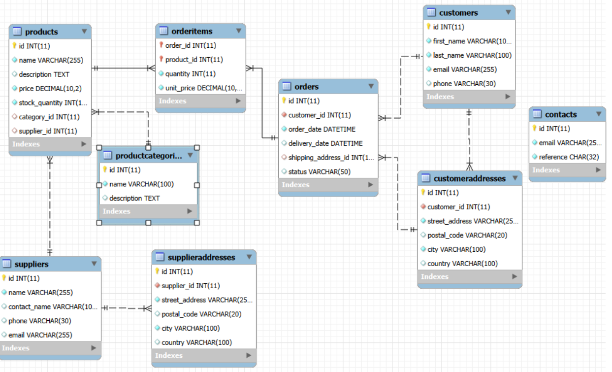

# Course Project Data Solution Report
This project was implemented with the assistance of Microsoft Copilot. Copilot provided code suggestions for SQL views, triggers, and events, providing code suggestions for REST API endpoints; reviewed documentation structure; and assisted with grammar checks.
## 1. Project Overview
This project implements a **REST-API Webshop Backend** using Spring Boot 4.1.1, Java 21, Maven and MariaDB 11.5.
The system provides:

Full CRUD operations for all core webshop resources

Payment processing using table inheritance (cash, card, voucher)

Rich database functionality including views, triggers, indexes, events, temporal features, and transactions

A comprehensive API suitable for both end users (webshop customers) and administrators (reporting, analytics, stock management)

## 2 Provied database overview
Analysing Main database tables:

|Table|	Description|Relationship|
|-----|------------|--------|
|products|	Product catalog|
|productcategories|	Product categories|
|suppliers|	Supplier information|
|supplieraddresses|	Supplier addresses|
|customers|	Customer information|
|customeraddresses|	Customer addresses|
|orders|	Orders placed by customers|
|orderitems|	Items inside each order|
|contacts|	Customer contact messages|No|
||Payment system using table inheritance|

Database Structure after adding table inheritance for payment(PaymentInheritance(parent),Cash, Card, Vouche(child)) and creating relationship for contacts

## 3. Implement
### 3.1 Create entities, repositories, services, controllers(endpoints)
[Source Code Folder](./src/main/java/com/thanh/project)

### 3.2 API Endpoints(CRUD for 10 tables)

<strong>Click to expand Postman API test list</strong>

#### 3.2.1 Products API
|Method|	Endpoint|	Purpose|	Role|	Request Format|	Response Format|
|-----|------------|--------|-----|------------|--------|
|GET|	/products|	Get the products list to display in webshop|	User|	None|	[{id, name, price, stock_quantity, category_id, supplier_id}]|
|GET|	/products/{id}|	Get the product details|	User|	None|	{id, name, description, price, stock_quantity, category_id, supplier_id}|
|POST|	/products|	Create a new product|	Admin|	{name, description, price, stock_quantity, category_id, supplier_id}|	{id,name, description, price, stock_quantity, category_id, supplier_id}|
|PUT|	/products/{id}|	Update the product|	Admin|	{name?, description?, price?, stock_quantity?, category_id?, supplier_id?}|	{id,name, description, price, stock_quantity, category_id, supplier_id}|
|DELETE|	/products/{id}|	Delete the product|	Admin|	None|	{message: "deleted"}|

#### 3.2.2 Product Categories API
|Method|	Endpoint|	Purpose|	Role|	Request Format|	Response Format|
|-----|------------|--------|-----|------------|--------|
|GET|	/categories|	Get type of product list|	User|Admin|	None|	[{id, name}]|
|GET|	/categories/{id}|	Get type details|	Admin|	None|	{id, name}|
|POST|	/categories|	Create a new type|	Admin|	{name}|	{id, name}|
|PUT|	/categories/{id}|	Update the type|	Admin|	{name}|	{id, name}
|DELETE|	/categories/{id}|	Delete the type|	Admin|	None|	{message: "deleted"}|

#### 3.2.2 Suppliers API
|Method|	Endpoint|	Purpose|	Role|	Request Format|	Response Format|
|-----|------------|--------|-----|------------|--------|
|GET|	/suppliers|	Get supplies list|	User|Admin|	None|	[{id, name, phone, email}]|
|GET|	/suppliers/{id}|	Get supplyer details|	Admin|	None|	{id, name, phone, email}|
|POST|	/suppliers|	Create a new supplyer|	Admin|	{name, contact_name, phone, email}|	{id, name, contact_name, phone, email}|
|PUT|	/suppliers/{id}|	Update the supplyer|	Admin|	{name, contact_name, phone, email}|	{id, name, contact_name, phone, email}
|DELETE|	/suppliers/{id}|	Delete the supplyer|Admin|	None|	{message: "deleted"}|

#### 3.2.4 Supplier Addresses API
|Method|	Endpoint|	Purpose|	Role|	Request Format|	Response Format|
|-----|------------|--------|-----|------------|--------|
|GET|	/supplier-addresses|	Get supplyer addresses list|	User|Admin|	None|	[{id, supplier_id, street, city, postal_code, country}]|
|GET|	/supplier-addresses/{id}|	Get supplyer address details|	Admin|	None|	{id, supplier_id, street, city, postal_code, country}|
|POST|	/supplier-addresses|	Create a new supplyer address|	Admin|	{supplier_id, street, city, postal_code, country}|	{id, supplier_id, street, city, postal_code, country}|
|PUT|	/supplier-addresses/{id}|	Update the supplyer address|	Admin|	{street?, city?, postal_code?, country?}|	{id, street?, city?, postal_code?, country?}|
|DELETE|	/supplier-addresses/{id}|	Delete the supplyer address|Admin|	None|	{message: "deleted"}|
#### 3.2.5 Customers API
|Method|	Endpoint|	Purpose|	Role|	Request Format|	Response Format|
|-----|------------|--------|-----|------------|--------|
|GET|	/customers|	Get customers list|	User|Admin|	None|	[{id, first_name, last_name, email, phone}]|
|GET|	/customers/{id}|	Get customer details|	Admin|	None|	{id, first_name, last_name, email, phone}|
|POST|	/customers|	Create a new customer|	Admin|	{first_name, last_name, email, phone}|	{id, first_name, last_name, email, phone}|
|PUT|	/customers/{id}|	Update the customer|	Admin|	{first_name?, last_name?, email?, phone?}|	{id, first_name?, last_name?, email?, phone?}|
|DELETE| /customers/{id}|	Delete customer |Admin|	None|	{message: "deleted"}|

#### 3.2.6 Customer Addresses API
|Method|	Endpoint|	Purpose|	Role|	Request Format|	Response Format|
|-----|------------|--------|-----|------------|--------|
|GET|	/customers-addresses|	Get customer addresses list|	User|Admin|	None|	[{id, customer_id, street, city, postal_code, country}]|
|GET|	/customers-addresses/{id}|	Get customer address details|	Admin|	None|	{id, customer_id, street, city, postal_code, country}|
|POST|	/customers-addresses|	Create a new customer address|	Admin|	{customer_id, street, city, postal_code, country}|	{id, customer_id, street, city, postal_code, country}|
|PUT|	/customers-addresses/{id}|	Update the customer address|	Admin|	{street?, city?, postal_code?, country?}|	{id, street?, city?, postal_code?, country?}|
|DELETE| /customers-addresses/{id}|	Delete customer |Admin|	None|	{message: "deleted"}|

#### 3.2.7 Orders API
|Method|	Endpoint|	Purpose|	Role|	Request Format|	Response Format|
|-----|------------|--------|-----|------------|--------|
|GET|	/orders|	Get orders list|	User|Admin|	None|	[{id, customer_id, order_date, delivery_date, sipping_address_id, status}]|
|GET|	/orders/{id}|	Get order details|	User/Admin|	None|	{id, customer_id, order_date, delivery_date, sipping_address_id, status}|
|POST|	/orders|	Create a new order|	User|	{customer_id, order_date, delivery_date, sipping_address_id, status}|	{id, id, customer_id, order_date, delivery_date, sipping_address_id, status}|
|PUT|	/orders/{id}|	Update the order|	Admin|	{delivery_date?, status?}|	{id, delivery_date?, status?}|
|DELETE| /orders/{id}|	Delete order |Admin|	None|	{message: "deleted"}|

#### 3.2.8 Order Items API
|Method|	Endpoint|	Purpose|	Role|	Request Format|	Response Format|
|-----|------------|--------|-----|------------|--------|
|GET|	/orders-items|	Get order's items list|	User|Admin|	None|	[{id, order_id, product_id, quantity, unit_price}]|
|GET|	/orders-items/{id}|	Get order's item details|	Admin|	None|{id, order_id, product_id, quantity, unit_price}|
|POST|	/orders-items|	Create a new item|	Admin|	{order_id, product_id, quantity, unit_price}|	{id, id, order_id, product_id, quantity, unit_price}|
|PUT|	/orders-items/{id}|	Update the item|	User/Admin|	{order_id, product_id, quantity, unit_price}|	{id, order_id, product_id, quantity, unit_price}|
|DELETE| /orders-items/{id}|	Delete item |Admin|	None|	{message: "deleted"}|

#### 3.2.9 Contacts API
|Method|	Endpoint|	Purpose|	Role|	Request Format|	Response Format|
|-----|------------|--------|-----|------------|--------|
|GET|	/contacts|	Get contacts list|	Admin|	None|	[{id, customer_id, email, reference, created_at}]|
|GET|	/contacts/{id}|	Get contact details|Admin|	None|{id, customer_id, email, reference, created_at}|
|POST|	/contacts|	Create a new contact|	Admin|	{customer_id, email, reference}|	{id, customer_id, email, reference}|
|PUT|	/contacts/{id}|	Update the contact|	Admin|	{email?, reference?}|	{id, email?, reference?}|

#### 3.2.10 Payment Inheritance API
|Method|	Endpoint|	Purpose|	Role|	Request Format|	Response Format|
|-----|------------|--------|-----|------------|--------|
|GET|	/payments|	Get payments list|	User|Admin|	None|	[{payment_id, order_id, amount, payment_type, payment_date}]|
|GET|	/payments/{id}|	Get payment detail|	User/Admin|	None|{payment_id, order_id, amount, payment_type, payment_date}|
|POST|	/payments|	Create a new payment|	User|	{order_id, amount, payment_type, extra_fields}|	{id, order_id, amount, payment_type, extra_fields}|
|DELETE| /payments/{id}|	Delete payments |Admin|	None|	{message: "deleted"}|

### 3.3. Database Features
#### 3.3.1 Views API (Method: GET)
|View|	Endpoint|	Purpose|	Role|	Request Format|	Response Format|
|-----|------------|--------|-----|------------|--------|
|customer_order_view|/views/customer-orders|Allows customers/admins to view order history|	User/Admin|	None|[{customer_id, first_name, last_name, order_id, total_price, ...}]|
|order_detail_view|	/views/order-details|	Shows product-level details inside orders|	User/Admin|	None|[{order_id, product_name, quantity, item_total, ...}]|
|product_sales_view|	/views/product-sales|	Identifies best-selling products|	Admin|	[{product_id, product_name, total_quantity_sold, total_revenue}]|
|monthly_revenue_view|	/views/revenue/monthly|	Supports financial reporting|	Admin|	[{month, total_revenue}]
|customer_total_spending_view|	/views/customer-spending| Helps identify high-value customers|	Admin|	[{customer_id, total_spent}]|
|low_stock_view|	/views/low-stock|	Prevents stockouts by early detection|	Admin|	[{product_id, product_name, stock_quantity}]|
|payment_summary_view|	/views/payments/Provides a unified payment summary|	Admin|	[{payment_id, order_id, amount, payment_type}]|
|daily_payment_view|	/views/payments/daily|	Supports daily financial reconciliation|	Admin|	[{payment_day, total_payment}]|
|revenue_payment_compare_view|	/views/revenue/compare|	Ensures collected payments match system revenue|	Admin|	[{revenue_date, total_revenue, total_payment, difference}]|

#### 3.3.2 Indexes
|Feature|	Desription|	Role|Purpose|
|-----|------------|--------|-----|
|idx_product_categor	Index on category_id|	User/Admin|	Speeds up product filtering by category|
|idx_product_supplier|	Index on supplier_id|	Admin|	Improves supplier-based product queries|
|idx_order_customer|	Index on customer_id|	User/Admin|	Faster retrieval of customer orders|
|idx_order_status|	Index on status|	Admin|	Efficient filtering of orders by status (NEW, DELIVERED, CANCELLED)|
|idx_orderitems_order|	Index on order_id|	User/Admin|	Speeds up order → orderitems joins|
|idx_orderitems_produc	Index on product_id|	Admin|	Improves product sales analytics|

#### 3.3.3 Triggers
|Feature|	Desription|	Role|Purpose|
|-----|------------|--------|-----|
|update_order_total_after_item|	Auto-update order total when items are added|	User/Admin|	Ensures order totals are always accurate|
|auto_set_delivered|	Auto-set status to DELIVERED when delivery_date is set|	Admin|	Reduces manual status updates|
|restock_after_cancel|	Restock items when an order is cancelled|	Admin|	Maintains correct inventory levels|
|log_status_change|	Log order status changes|	Admin|	Provides temporal tracking of order lifecycle|
|product_price_update_trigger|	Log product price changes|	Admin|	Tracks price history for auditing|

#### 3.3.4 Events (Scheduler)
|Feature|	Desription|	Role|Purpose|
|-----|------------|--------|-----|
|cleanup_cancelled_orders|	Delete cancelled orders older than 30 days|	Admin|	Reduces database clutter|
|auto_mark_overdue|	Mark overdue orders automatically|	Admin|	Automates order lifecycle management|
|revenue_daily|	Generate daily revenue report|	Admin|	Provides temporal revenue data for comparison|

#### 3.3.5 Temporal Features
|Feature|	Desription|	Role|Purpose|
|-----|------------|--------|-----|
|order_status_log|	Trigger|	Admin|	Enables temporal auditing|
|product_price_history|	Trigger|	Admin|	Tracks price evolution|
|revenue_daily|	Event|	Admin|	Supports revenue reconciliation|
|generate_daily_revenue|	Event|	Admin|	Automates repetitive business logic|

#### 3.3.6 Transactions
|Feature|	Desription|	Role|Purpose|
|-----|------------|--------|-----|
|@Transactional in PaymentService|	Payment + child tables + order update in one transaction|	User/Admin|	Prevents partial payment failures and ensures data consistency|
|@Transactional in OrderService.createOrder|	Creates order + inserts order items + updates stock in one atomic operation	|User|	Ensures order creation never results in half-created orders or incorrect stock|
|@Transactional in OrderService.deleteOrder|	Deletes order + deletes order items in one atomic operation	|Admin|	Prevents orphaned order items and ensures referential integrity|
## 4. Postman test
This section lists all API endpoints tested using Postman.
Each endpoint includes the HTTP method and the exact URL used during testing.

<strong>Click to expand Postman API test list</strong>

### 4.1 Product Endpoints
GET    http://localhost:8081/products

GET    http://localhost:8081/products/{id}

POST   http://localhost:8081/products

PUT    http://localhost:8081/products/{id}

DELETE http://localhost:8081/products/{id}
### 4.2 Product Category Endpoints
GET    http://localhost:8081/categories

GET    http://localhost:8081/categories/{id}

POST   http://localhost:8081/categories

PUT    http://localhost:8081/categories/{id}

DELETE http://localhost:8081/categories/{id}
### 4.3 Supplier Endpoints
GET    http://localhost:8081/suppliers

GET    http://localhost:8081/suppliers/{id}

POST   http://localhost:8081/suppliers

PUT    http://localhost:8081/suppliers/{id}

DELETE http://localhost:8081/suppliers/{id}
### 4.4 Supplier Address Endpoints
GET    http://localhost:8081/supplier-addresses

GET    http://localhost:8081/supplier-addresses/{id}

POST   http://localhost:8081/supplier-addresses

PUT    http://localhost:8081/supplier-addresses/{id}

DELETE http://localhost:8081/supplier-addresses/{id}

### 4.5 Customer Endpoints
GET    http://localhost:8081/customers

GET    http://localhost:8081/customers/{id}

POST   http://localhost:8081/customers

PUT    http://localhost:8081/customers/{id}

DELETE http://localhost:8081/customers/{id}

### 4.6 Customer Address Endpoints
GET    http://localhost:8081/customer-addresses

GET    http://localhost:8081/customer-addresses/{id}

POST   http://localhost:8081/customer-addresses

PUT    http://localhost:8081/customer-addresses/{id}

DELETE http://localhost:8081/customer-addresses/{id}
### 4.7 Order Endpoints
GET    http://localhost:8081/orders

GET    http://localhost:8081/orders/{id}

POST   http://localhost:8081/orders

PUT    http://localhost:8081/orders/{id}

DELETE http://localhost:8081/orders/{id}
### 4.8 Order Item Endpoints
GET    http://localhost:8081/order-items

GET    http://localhost:8081/order-items/{id}

POST   http://localhost:8081/order-items

PUT    http://localhost:8081/order-items/{id}

DELETE http://localhost:8081/order-items/{id}
### 4.9 Contact Endpoints
GET    http://localhost:8081/contacts

GET    http://localhost:8081/contacts/{id}

POST   http://localhost:8081/contacts

PUT    http://localhost:8081/contacts/{id}

DELETE http://localhost:8081/contacts/{id}
### 4.10 Payment Endpoints (Inheritance)
GET    http://localhost:8081/payments

GET    http://localhost:8081/payments/{id}

POST   http://localhost:8081/payments

DELETE http://localhost:8081/payments/{id}
### 4.11 View Endpoints (Reporting)
GET http://localhost:8081/views/customer-orders

GET http://localhost:8081/views/order-details

GET http://localhost:8081/views/product-sales

GET http://localhost:8081/views/revenue/monthly

GET http://localhost:8081/views/customer-spending

GET http://localhost:8081/views/low-stock

GET http://localhost:8081/views/payments/summary

GET http://localhost:8081/views/payments/daily

GET http://localhost:8081/views/revenue/compare

## 5. Continuing Development
Role-based authentication and authorization  
Implementing user roles (admin, customer) and secure access control for sensitive endpoints.

Input validation and error handling  
Adding comprehensive validation rules, standardized error responses, and improved exception management.
